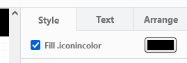

# SVG to draw.io Convertor
This tool transforms a list of svg images into a draw.io compatible XML library with editable CSS values.
Currently, this will work with svg images that only contain a single path property as in the example below.

## Example Usage
In this example, we will transform the [FontAwesome](https://fontawesome.com/) free icon pack into a draw.io compatible XML library.
I am in no way affiliated with FontAwesome besides being a user of the free icon pack under the [CC-BY-4.0 license](https://creativecommons.org/licenses/by/4.0/). This repository does not redistribute the icon package and leaves all licensing information in tact during the conversion of the svg files.

### Step 1 - Preparing the SVG files
1. Download and extract the [Fontawesome Free for Desktop](https://fontawesome.com/download) package (or any other set of .svg icons).
2. Move them into a folder in this repository like this:
    ```
    svgtodrawio/svg-to-drawio.py
    svgtodrawio/fontawesome/0.svg
    svgtodrawio/fontawesome/1.svg
    svgtodrawio/fontawesome/2.svg
    ...
    ```

### Step 2 - Running the Script
0. Make sure you have Python installed.
1. Open a terminal in the repository folder.
2. Run the following command to execute the Python script:

    `python ./svgtodrawio.py "fontawesome/" "#000000"`

    You can replace `fontawesome/` with the relative path to the .svg files and `#000000` with the default color you want for the icons in draw.io.

The script will take a few seconds depending on the size of the image pack. Once completed, you should find your XML library in the repository folder.
By default, this script will use the input folder name as the filename for the library.
If you want to use a different name, just rename the .xml file.

### Step 3 - Importing the Library in Draw.io
1. Open the project where you want to import the library.
2. Press `File > Open Library from > Device...`
3. Select the XML file generated by the script.

You should now be able to use your XML library in draw.io. You can change the fill color after inserting and selecting an object on the right under the style tab.


